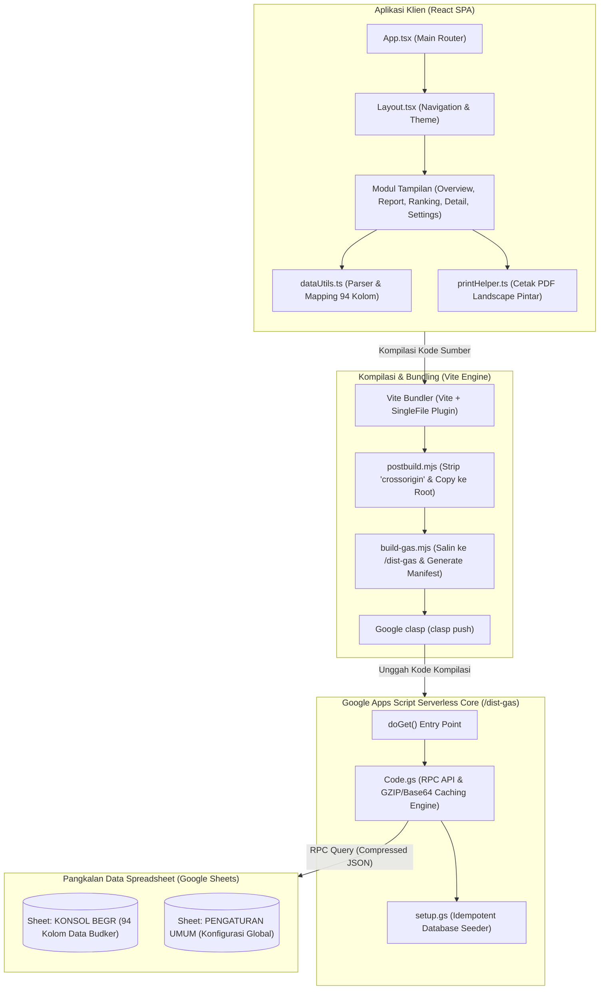

# BI-BEGR Culture Dashboard
> Dasbor Pemantauan Budaya KONSOL BEGR Bank Indonesia Berbasis Serverless Google Apps Script dan Google Sheets

[](https://react.dev/)
[](https://vite.dev/)
[](https://developers.google.com/apps-script)
[](https://www.google.com/sheets/about/)
[](https://tailwindcss.com/)
[](https://www.typescriptlang.org/)
[](#)

---

## 1. Ringkasan Eksekutif

**BI-BEGR Culture Dashboard** adalah platform visualisasi telemetri budaya kerja tingkat tinggi yang dioperasikan secara serverless di atas ekosistem **Google Workspace**. Sistem ini dirancang untuk memantau kematangan budaya kerja (*Culture Maturity Level* - CML) di seluruh Satuan Kerja (Satker) Bank Indonesia (Kantor Pusat dan Kantor Perwakilan).

Dengan memanfaatkan **Google Sheets** sebagai pangkalan data utama (*single source of truth*) dan **Google Apps Script (GAS)** sebagai lingkungan eksekusi serverless, dasbor ini menyajikan analisis 360 derajat terkait efektivitas program budaya (*Championship Program*), Employee Value Proposition (EVP), Nilai-Nilai Strategis (NNS), dan kepatuhan unit tanpa memerlukan biaya infrastruktur server tambahan (*Zero-TCO hosting*).

---

## 2. Alur Arsitektur & Aliran Data

Aplikasi ini menggunakan pipa kompilasi (*compilation pipeline*) teroptimasi yang membundel aplikasi React SPA (*Single Page Application*) menjadi berkas HTML tunggal (*self-contained inline assets*) agar dapat dijalankan di dalam container `HtmlService` Google Apps Script.



---

## 3. Struktur Direktori Proyek

Penyusunan berkas mengikuti prinsip modularitas arsitektur React yang dikombinasikan dengan struktur proyek Google Apps Script Clasp:

```mermaid
flowchart TD
    Root["bi---wide (Root Project)"]
    
    Root --> gas_src["gas-src/ (GAS Backend Source)"]
    gas_src --> CodeGS["Code.gs (API RPC & Cache)"]
    gas_src --> SetupGS["setup.gs (Skema & Seeder Database)"]
    
    Root --> src["src/ (React Frontend Source)"]
    src --> AppTSX["App.tsx (Entri Utama Aplikasi)"]
    src --> indexCSS["index.css (Sistem Desain Tailwind)"]
    src --> Components["components/ (Pustaka Komponen)"]
    Components --> Dashboard["dashboard/ (Views / Panel Halaman)"]
    Dashboard --> OverviewView["OverviewView.tsx (Metrik Utama)"]
    Dashboard --> ReportView["ReportView.tsx (Laporan KPI Konsolidasi)"]
    Dashboard --> RankingView["RankingView.tsx (Leaderboard Satker)"]
    Dashboard --> SatkerDetailView["SatkerDetailView.tsx (Analisis 360°)"]
    Dashboard --> BeforeTripView["BeforeTripView.tsx (Read-only Data Master)"]
    Dashboard --> SettingsView["SettingsView.tsx (Form Sinkronisasi)"]
    
    Components --> LayoutComp["layout/ (Layout.tsx - Frame Navigasi)"]
    Components --> UI["ui/ (Komponen UI Atomik & Modals)"]
    
    src --> Contexts["contexts/ (FilterContext.tsx - Global State)"]
    src --> Data["data/ (dataUtils.ts - Pemrosesan & Mapping Kolom)"]
    src --> Lib["lib/ (printHelper.ts - Fungsi Cetak Laporan)"]
    
    Root --> Scripts["scripts/ (Alat Bantu Build)"]
    Scripts --> BuildGasMJS["build-gas.mjs (Penyusun Aset GAS)"]
    
    Root --> DistGas["dist-gas/ (Direktori Hasil Build Target Clasp)"]
    DistGas --> AppScriptJSON["appsscript.json (Manifest GAS)"]
    
    Root --> ConfigFiles["Konfigurasi Proyek"]
    ConfigFiles --> PackageJSON["package.json (Script & Dependensi)"]
    ConfigFiles --> ViteConfig["vite.config.ts (Konfigurasi Vite)"]
    ConfigFiles --> ClaspJSON[".clasp.json (Konfigurasi Clasp Root)"]
```



---

## 4. Fitur Utama Dasbor

1. **Overview Dashboard (Swiss-Style Minimalism)**: 
   Menyajikan agregasi metrik makro tingkat nasional, diagram radar untuk 5 dimensi Nilai-Nilai Strategis (NNS), grafik batang capaian EVP & Pilar Budaya dengan garis batas target kelulusan acuan, serta status kematangan satker *Top 3* dan *Bottom 3*.
2. **Laporan KPI Konsolidasi (Executive Report Page)**:
   Layout Bento Grid eksklusif untuk menyajikan pencapaian rata-rata CML BI-Wide, rasio kelulusan unit (% Satker di atas rata-rata), matriks perbandingan dimensi strategis (EVP vs Pilar Budaya) dengan *segmented control* interaktif, klasifikasi sebaran tingkat kematangan, dan sorotan kualitatif performa program kebudayaan.
3. **Leaderboard Interaktif (Ranking View)**:
   Papan peringkat dinamis berkinerja tinggi yang mendukung pengurutan menaik/menurun (*sorting*), pencarian teks instan, dan filter taktis berdasarkan kelompok budker.
4. **Analisis Detail Satker 360° (Deep-Dive Analysis)**:
   Analisis komprehensif satu satuan kerja tertentu yang menyandingkan visualisasi radar NNS satker, deviasi vs target nasional, serta visualisasi komponen *Championship Program* secara detail yang dilengkapi fitur modal ekspansi grafik (*fullscreen mode*).
5. **Manajemen Data Terintegrasi (Data Master & Settings)**:
   Antarmuka *Read-Only* data master terproteksi yang menyajikan tabel data mentah 94 kolom secara rapi. Form sinkronisasi dua arah (`SettingsView`) memfasilitasi modifikasi parameter global (seperti judul dasbor, target batas kelulusan acuan CML skala 1-4) langsung ke lembar Spreadsheet.

---

## 5. Panduan Pengembangan Lokal

### Prasyarat System
* **Node.js** (Versi v18 ke atas disarankan)
* **npm** (Versi v9 ke atas)

### 1. Instalasi Dependensi
Jalankan perintah berikut di direktori root proyek untuk memasang pustaka pengembangan:
```bash
npm install
```

### 2. Konfigurasi Lingkungan Lokal
Salin file `.env.example` menjadi `.env.local` dan masukkan kunci API Gemini untuk mengaktifkan modul analisis pintar (jika digunakan):
```bash
cp .env.example .env.local
```

### 3. Menjalankan Server Pengembangan Lokal
Jalankan server Vite lokal untuk melakukan modifikasi antarmuka dengan fitur *Hot Module Replacement* (HMR):
```bash
npm run dev
```
Aplikasi lokal akan berjalan pada alamat: `http://localhost:3000`.

---

## 6. Prosedur Kompilasi & Deployment ke Google Sheets

Dasbor dikompilasi menggunakan skrip build khusus yang mereduksi seluruh berkas aset (HTML, JS, CSS, Ikon) ke dalam satu file mandiri agar kompatibel dengan lingkungan sandbox Google Apps Script.

### 1. Proses Kompilasi Otomatis (Build)
Jalankan perintah berikut untuk mengompilasi proyek frontend dan menyusun struktur target GAS secara simultan:
```bash
npm run build:all
```
Perintah di atas mengeksekusi runtutan proses berikut secara berurutan:
1. `vite build`: Memanggil bundler Vite untuk membuat file HTML tunggal dengan injeksi CSS/JS via `vite-plugin-singlefile`.
2. `node postbuild.mjs`: Mengeksekusi berkas [postbuild.mjs](file:///c:/Users/IKHSAN%20KAMAL/Downloads/PROJECT%20-%20APPSCRIPT/bi---wide/postbuild.mjs) untuk membuang atribut `crossorigin` dari elemen `<script>` (karena diblokir oleh GAS HtmlService) serta menyalinnya ke `Dashboard-for-Spreadsheet.html` di root.
3. `node scripts/build-gas.mjs`: Mengeksekusi berkas [scripts/build-gas.mjs](file:///c:/Users/IKHSAN%20KAMAL/Downloads/PROJECT%20-%20APPSCRIPT/bi---wide/scripts/build-gas.mjs) untuk menyalin berkas backend [gas-src/Code.gs](file:///c:/Users/IKHSAN%20KAMAL/Downloads/PROJECT%20-%20APPSCRIPT/bi---wide/gas-src/Code.gs) dan [gas-src/setup.gs](file:///c:/Users/IKHSAN%20KAMAL/Downloads/PROJECT%20-%20APPSCRIPT/bi---wide/gas-src/setup.gs) ke direktori `/dist-gas`, serta membuat manifes runtime `appsscript.json`.

### 2. Mengunggah Kode ke Apps Script (Deploy)
Pastikan Anda sudah login ke Clasp (`clasp login`) dan berkas [.clasp.json](file:///c:/Users/IKHSAN%20KAMAL/Downloads/PROJECT%20-%20APPSCRIPT/bi---wide/.clasp.json) telah menunjuk pada ID script spreadsheet Anda yang valid. Unggah hasil build dari direktori `/dist-gas` dengan perintah:
```bash
npx clasp push
```

---

## 7. Informasi Berkas Utama Proyek

* **[package.json](file:///c:/Users/IKHSAN%20KAMAL/Downloads/PROJECT%20-%20APPSCRIPT/bi---wide/package.json)**: Menyimpan definisi skrip eksekusi dan dependensi modul.
* **[src/App.tsx](file:///c:/Users/IKHSAN%20KAMAL/Downloads/PROJECT%20-%20APPSCRIPT/bi---wide/src/App.tsx)**: Mengontrol render utama tab aktif dasbor dan penanganan event sinkronisasi data global.
* **[src/data/dataUtils.ts](file:///c:/Users/IKHSAN%20KAMAL/Downloads/PROJECT%20-%20APPSCRIPT/bi---wide/src/data/dataUtils.ts)**: Mengatur pemetaan data terstruktur dari respon Spreadsheet 94 kolom ke dalam format objek JavaScript/TypeScript yang digunakan komponen visual.
* **[src/lib/printHelper.ts](file:///c:/Users/IKHSAN%20KAMAL/Downloads/PROJECT%20-%20APPSCRIPT/bi---wide/src/lib/printHelper.ts)**: Mengatur optimasi tata letak media cetak (PDF) secara landscape dan pembersihan tema gelap sementara saat inisiasi perintah cetak browser.
* **[gas-src/Code.gs](file:///c:/Users/IKHSAN%20KAMAL/Downloads/PROJECT%20-%20APPSCRIPT/bi---wide/gas-src/Code.gs)**: Mengatur API server backend, optimasi latensi menggunakan penyimpanan Cache kompresi GZIP, serta menangani modifikasi sinkronisasi data sel spreadsheet.
* **[gas-src/setup.gs](file:///c:/Users/IKHSAN%20KAMAL/Downloads/PROJECT%20-%20APPSCRIPT/bi---wide/gas-src/setup.gs)**: Menginisialisasi format lembar kerja `KONSOL BEGR` dan `PENGATURAN UMUM` secara otomatis, meliput pembuatan 94 kolom header, pembekuan baris, formula acuan, dan pengisian data contoh (*seed data*).
